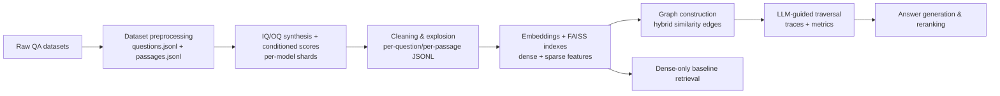

# Retrieval-Augmented Graph QA

Multi-hop question answering pipeline that pairs retrieval-augmented generation (RAG) with graph traversal. The system synthesizes questions, links passages via a passage graph, retrieves multi-hop evidence, and scores answers while persisting every artifact for auditability.

## Key features
- **Question synthesis and scoring** across passages (IQ/OQ) using local LLM servers with optional conditioned scores.
- **Hybrid passage graph** construction that blends cosine and Jaccard similarity for hop-aware retrieval.
- **Traversal + dense baseline** flows for apples-to-apples evaluation of HopRAG versus FAISS-only retrieval.
- **Artifact-first design**: every phase writes JSONL, FAISS indexes, debug logs, and traces for reproducibility.
- **Resume-friendly processing** for sharded generation, cleaning, embedding, and traversal steps.

## Quickstart (install → run → verify)
1. **Install**
   ```bash
   python -m venv .venv
   source .venv/bin/activate
   pip install --upgrade pip
   pip install -r requirements.txt
   ```
2. **Run a small pipeline slice**
   - Place raw datasets under `data/raw_datasets/{dataset}/...` (see the examples inside `src/a_dataset_preprocessing.py`).
   - Configure LLM servers in `src/utils.py::SERVER_CONFIGS` to match the ports/models you have running (llama.cpp-compatible `/v1/chat/completions` or `/completion` endpoints).
   - Generate processed questions/passages for a dataset split (respects `MAX_EXAMPLES` in the `__main__` guard):
     ```bash
     python -m src.a_dataset_preprocessing
     ```
   - Run IQ/OQ generation shards for a model by pointing `src/b_text_generation.py` at the processed passages:
     ```bash
     python -m src.b_text_generation  # uses SERVER_CONFIGS and shard settings in the module
     ```
3. **Verify**
   - Confirm the environment imports cleanly:
     ```bash
     python -m compileall src
     ```
   - Check that new artifacts appear under `data/models/{model}/{dataset}/{split}/shards/` and `data/processed_datasets/{dataset}/{split}/`.

## Usage (common workflows)
- **Dataset preprocessing** – `src/a_dataset_preprocessing.py::process_dataset` normalizes raw QA data to `questions.jsonl` and `passages.jsonl` with configurable field maps.
- **Question generation** – `src/b_text_generation.py` shards passages per model size, writes conditioned scores, and produces IQ/OQ lists plus per-shard debug logs.
- **Cleaning & explosion** – `src/c_file_prep.py` merges shard outputs, filters IQ/OQ lists, and explodes them into per-question/per-passage JSONLs for embeddings.
- **Representations** – `src/d_sparse_dense_representations.py` embeds passages and IQ/OQ items (BGE + FAISS) and enriches with spaCy keyword features.
- **Graph construction** – `src/e_graphing.py` builds hybrid-similarity edge lists and NetworkX graphs within a global budget for each model/dataset/variant.
- **Traversal & answering** – `src/f_traversal.py` performs LLM-guided hops, records traces, and computes retrieval metrics; `src/h_reranking_answer_gen.py` handles reranking and answer generation.
- **Baselines & metrics** – `src/g_dense_RAG.py` provides dense-only retrieval, while `src/metrics.py` and `src/metrics_summary.py` aggregate EM/F1 and latency.

### FIELD_ID / field_map basics
FIELD_ID and passage IDs define the canonical identity layer of the pipeline. These identifiers are reused across preprocessing, embeddings, graph construction, traversal, gold alignment, and metrics.

- **get_id(ex) -> str** – Returns a stable, unique question identifier (the FIELD_ID) for a single raw example.
Example (.txt):
lambda ex: ex["my_qid_col"]

- **get_question(ex) -> str** – Returns the question text associated with the FIELD_ID.
Example (.txt):
lambda ex: ex["question_text"]

**get_answer(ex) -> str** (optional) – Returns the gold answer if available; otherwise an empty string.
Example (.txt):
lambda ex: ex.get("gold_answer", "")

**iter_passages(ex) ->** Iterable[(passage_id, title, text)] – Emits all passages to be indexed for the example.
The emitted passage_id is the canonical key used across embeddings, graph edges, traversal traces, and metrics.
Example (.txt):
lambda ex: [(pid_plus_title(ex["my_qid_col"], p["title"], i), p["title"], p["text"]) for i, p in enumerate(ex["paras"])]

**gold_passage_ids(ex)** -> Iterable[str] (optional) – Returns IDs of supporting passages that must exactly match the passage_ids emitted by iter_passages.
Critical constraint – IDs must match byte-for-byte. Any mismatch will silently invalidate gold supervision and retrieval metrics.
Example (.txt):
lambda ex: [pid_plus_title(ex["my_qid_col"], p["title"], p["idx"]) for p in ex.get("supporting", [])]

After wiring the field_map (see patterns in src/a_dataset_preprocessing.py), run preprocessing:
python -m src.a_dataset_preprocessing

## Configuration (env vars, files, flags)
- **LLM servers**: edit `src/utils.py::SERVER_CONFIGS` to point to your running endpoints and models.
- **Token + sampling defaults**: `src/config.py` defines `MAX_TOKENS`, `TEMPERATURE`, and `LLM_DEFAULTS`.
- **Embeddings**: override `BGE_MODEL` and `SPACY_MODEL` env vars for encoder and spaCy pipeline selection (defaults: `BAAI/bge-base-en-v1.5`, `en_core_web_sm`).
- **Resume flags**: many modules expose a `RESUME` argument to skip already-written IDs when re-running steps.
- **Paths**: helper path constructors in `src/utils.py` and `src/d_sparse_dense_representations.py` standardize where processed, embedded, and graph artifacts live.

## Architecture
The pipeline is organized as a sequence of modular stages that write files other stages consume, enabling partial reruns and cross-model comparisons.



Artifacts are stored under `data/processed_datasets/`, `data/models/`, `data/representations/`, `data/graphs/`, `data/traversal/`, and `data/results/` for downstream inspection.

## Observability (logs, metrics, traces)
- Per-shard debug logs for conditioned scores and IQ/OQ generation are written alongside shard outputs in `data/models/{model}/{dataset}/{split}/shards/{hoprag_version}/`.
- Traversal traces and answer logs are emitted by `src/f_traversal.py`, enabling step-by-step hop reconstruction.
- Token accounting is logged in `src/llm_utils.py` for each query/response pair; aggregate metrics live in `data/results/` and can be summarized with `src/metrics_summary.py`.

## Deployment
- Designed for local or single-node runs where llama.cpp-compatible servers are reachable on the configured ports. Ensure GPU availability to accelerate BGE embeddings (falls back to CPU otherwise).
- Schedule long-running stages (generation, embeddings, traversal) with resumable flags to survive interruptions; outputs are append-only JSONL/FAISS files.

## Benchmark snapshots (dev splits; averaged across 3 seeds)

Traversal-generated answers (baseline HopRAG) compared with the retrieval-only baseline (dense/FAISS). EM/F1 are averaged over three seeds per model. Separate tables are shown per dataset.

### HotpotQA

| Model | Traversal F1 | Traversal APT | Hybrid F1 |
| --- | --- | --- | --- |
| deepseek-r1-distill-qwen-14b | 26.66 | 25,698 | 45.58 |
| deepseek-r1-distill-qwen-7b | 27.07 | 25,533 | 21.86 |
| qwen2.5-14b-instruct | 27.03 | 25,343 | 30.37 |
| qwen2.5-2x7b-moe-power-coder-v4 | 27.21 | 25,572 | 7.49 |
| qwen2.5-7b-instruct | 28.16 | 26,382 | 29.75 |
| state-of-the-moe-rp-2x7b | 25.02 | 25,325 | 30.55 |

### Musique

| Model | Traversal F1 | Traversal APT | Hybrid F1 |
| --- | --- | --- | --- |
| deepseek-r1-distill-qwen-14b | 16.62 | 60,136 | 30.77 |
| deepseek-r1-distill-qwen-7b | 16.20 | 59,566 | 17.42 |
| qwen2.5-14b-instruct | 14.71 | 60,081 | 14.73 |
| qwen2.5-2x7b-moe-power-coder-v4 | 20.40 | 59,456 | 6.68 |
| qwen2.5-7b-instruct | 16.68 | 58,562 | 9.59 |
| state-of-the-moe-rp-2x7b | 15.67 | 58,708 | 19.34 |

### 2WikiMultihopQA

| Model | Traversal F1 | Traversal APT | Hybrid F1 |
| --- | --- | --- | --- |
| deepseek-r1-distill-qwen-14b | 14.48 | 21,602 | 35.30 |
| deepseek-r1-distill-qwen-7b | 17.62 | 21,740 | 17.39 |
| qwen2.5-14b-instruct | 18.84 | 22,236 | 21.45 |
| qwen2.5-2x7b-moe-power-coder-v4 | 16.09 | 21,671 | 10.28 |
| qwen2.5-7b-instruct | 13.74 | 22,045 | 16.27 |
| state-of-the-moe-rp-2x7b | 17.92 | 21,819 | 16.42 |

## Llama.cpp and CUDA usage

- **LLM serving & determinism** – All generation, traversal edge selection, and answer reading call a local server compatible with llama.cpp’s `/v1/chat/completions` and `/completion` endpoints. Requests forward sampling controls plus optional seeds so llama.cpp responses (including traversal edge choices) are repeatable across runs.
- **GPU-accelerated embeddings** – Passage and IQ/OQ embeddings load the BGE encoder on CUDA when available, accelerating FAISS index construction and search while falling back to CPU otherwise.
